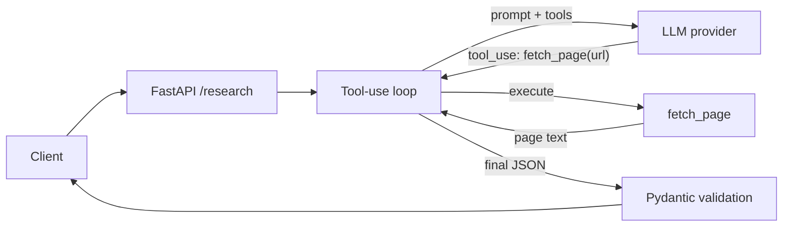

# Sales Research POC

AI-powered sales research API — fetches a company's site and returns structured outreach intelligence.

Given a company name (and optionally its website), the API runs an agentic
tool-use loop: the model decides which pages to read, calls a `fetch_page`
tool, reads the results, requests more pages if needed (`/about`, `/pricing`,
`/product`, ...), and finally returns validated, structured JSON.

## How it works



The model drives the tool loop; the app just executes tools and feeds results
back. If a page is blocked (e.g. a `403`), the error is returned to the model
so it can try another path instead of failing the request.

## Provider abstraction

Provider selection is an env var, so the same code runs in two modes:

| Mode | `LLM_PROVIDER` | Use |
| --- | --- | --- |
| Local dev (free) | `ollama` | No API key, runs on your machine |
| Cloud production | `claude` | Anthropic Messages API with native tool use |

Both providers implement the same `chat()` interface in [`app/providers/`](app/providers/),
translating one normalized message/tool format to their own API. Swapping
providers requires no changes to the agent loop.

## Stack

- FastAPI for the API.
- Provider-abstracted LLM layer: Ollama (local) or Claude (cloud).
- `fetch_page` exposed to the model as a tool.
- Pydantic for request and response validation.
- Optional Langfuse tracing for LLM observability.
- A small static chat frontend (served at `/`) for demos.

## Local Setup

```bash
python3 -m venv .venv
source .venv/bin/activate
pip install -r requirements.txt
cp .env.example .env
ollama serve
uvicorn app.main:app --reload
```

Open `http://127.0.0.1:8000/` for the chat UI, or call the API directly.

### Choosing a provider

Local, free (default):

```bash
LLM_PROVIDER=ollama
OLLAMA_MODEL=qwen2.5:7b   # any tool-calling model, e.g. llama3.2:3b
```

Cloud, Claude:

```bash
LLM_PROVIDER=claude
ANTHROPIC_API_KEY=sk-ant-...
CLAUDE_MODEL=claude-3-5-sonnet-latest
```

## Try It

```bash
curl -X POST http://127.0.0.1:8000/research \
  -H "Content-Type: application/json" \
  -d '{"company_name":"Stripe","company_url":"https://stripe.com"}'
```

## Example output

Real response from the local `ollama:qwen2.5:7b` provider (the model fetched
`stripe.com` via the tool before answering):

```json
{
  "model": "ollama:qwen2.5:7b",
  "research": {
    "company_name": "Stripe",
    "website": "https://stripe.com",
    "summary": "Stripe is a financial infrastructure company that provides comprehensive payment and financial tools for businesses of all sizes, enabling them to accept payments globally, offer financial services, and implement custom revenue models. It supports over 135 currencies and processes trillions in annual transactions.",
    "target_customers": ["Startups", "Enterprises", "SaaS platforms", "Retailers"],
    "value_proposition": "Stripe offers a reliable, extensible infrastructure for businesses to handle payments, manage subscriptions, and implement custom revenue models with low operational overhead. It supports various payment methods and provides tools for compliance, fraud prevention, and risk management.",
    "recent_signals": [],
    "outreach_angles": [
      "Partner with Stripe to expand your global payment capabilities",
      "Collaborate on innovative financial solutions for startups"
    ],
    "sources": [
      {
        "url": "https://stripe.com",
        "description": "Stripe's official homepage providing an overview of their services and target market."
      }
    ]
  }
}
```

## Langfuse Tracing (Optional)

Tracing is off unless both keys are set in `.env`:

```bash
LANGFUSE_PUBLIC_KEY=pk-lf-...
LANGFUSE_SECRET_KEY=sk-lf-...
LANGFUSE_HOST=https://cloud.langfuse.com
```

Restart uvicorn. Each `/research` call creates a trace with:

- `research-company` / `research-agent` chain
- `fetch-page` tool spans (one per page the model reads)
- `ollama-chat` / `claude-chat` generations (model, messages, output, token usage)

`GET /health` reports `"langfuse_enabled": true` when credentials are loaded,
and shows the active `provider`.

## Response Shape

The API returns `model` (the active provider label) plus a `research` object
with: `company_name`, `website`, `summary`, `target_customers`,
`value_proposition`, `recent_signals`, `outreach_angles`, and `sources`.

## Tests

```bash
.venv/bin/python -m pytest
```

The suite covers the tool-use loop (including fetch-error recovery), schema
validation, and the API endpoints with a scripted fake provider.
